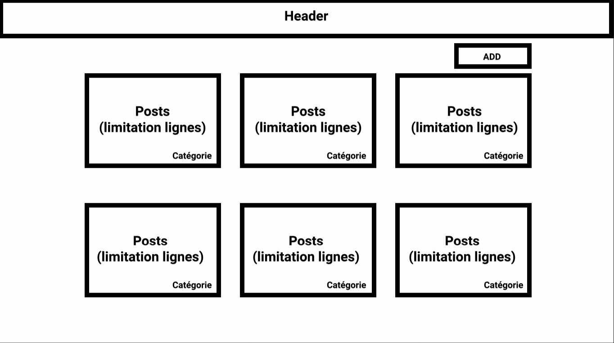
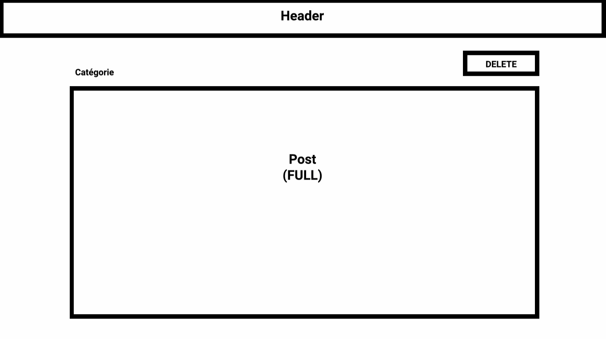
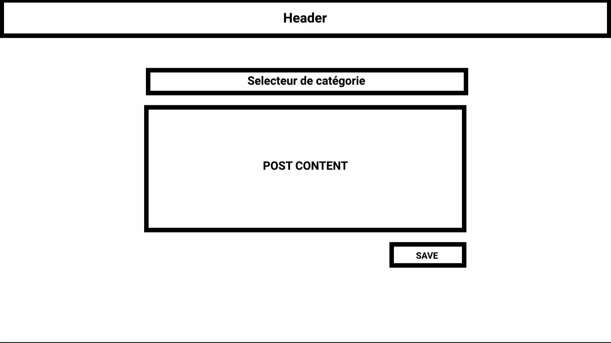

# Test

Docker compose **si possible**, car plus simple pour nous de tester.

## BACKEND

Sera une API PHP : [Laravel](https://laravel.com/) ou [Symfony](https://symfony.com/)

Entités : A minima Article et Catégories ( relation OneToMany )

### Routes

**Article**

- index (all)
- create
- show
- post
- delete

**Catégories**

Au choix, peuvent être hardcodés dans la base directement

## FRONTEND

Framework JS (avec routeur) : [VueJS](https://vuejs.org/) ou [ReactJS](https://fr.reactjs.org/)

Framework css : [Bootstrap 4](https://getbootstrap.com/)

### Pages

- Liste des articles triés par date de publication desc + label de la catégorie de l'article
- Page article : afficher le contenu + la catégorie
- Supprimer un article (Popup de validation sur la page show)
- Ajouter un article

### List :

### Show :

### Add :

### Wireframes

[LIEN vers les wireframes](wireframes.pdf) il n'est pas obligé de respecter le template c'est juste pour donner des idées.

### Github

Merci de **Fork** le projet et de nous envoyer le lien.

Utilisation des bonnes pratiques de Git

# Good luck
